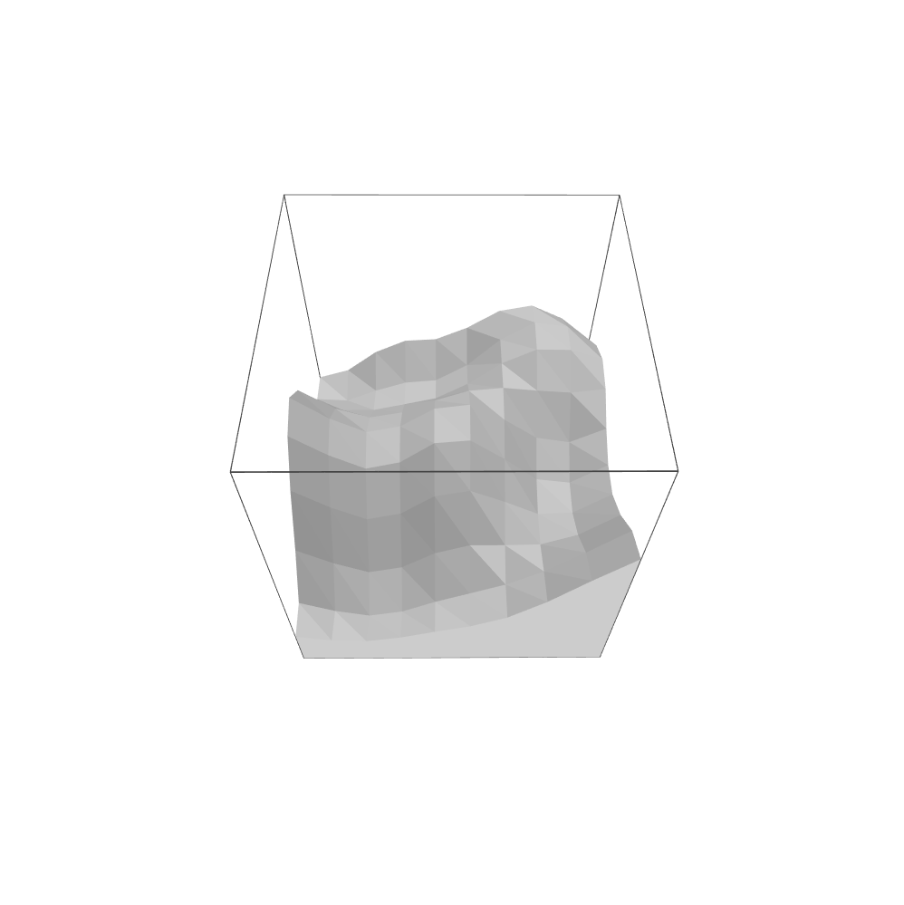

# perlin_plane
Generate a 3D-plane using Perlin Noise.
The underlying Noise can be modified at will, eg. a 2D sine-function to even out the edges or a fixed modifier to the noise.



## Build
  - Install ```glfw3``` using your Package Manager
  - ```cmake -B build```
  - ```cmake --build build```
